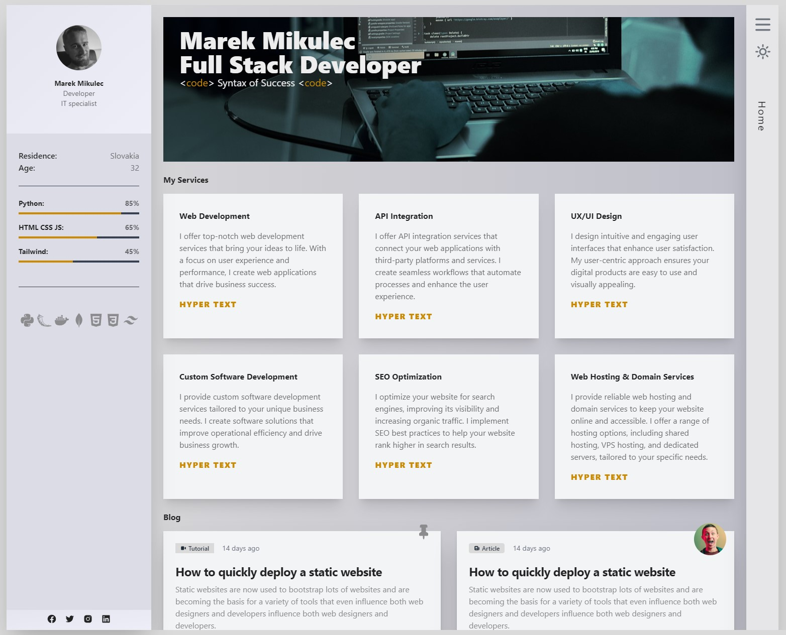

# Flask + Tailwind Web Application

This repository contains a Flask web application featuring a responsive design implemented with Tailwind CSS. The app is currently focused on the design aspect, with backend functionality to be added in the future.

## Features

- Responsive Design
- Light/Dark Mode Toggle
- Built with Flask and Tailwind CSS

## Light Mode & Dark Mode Preview

### Light Mode



### Dark Mode


## Getting Started

### Prerequisites

- Python 3.x
- Flask
- Tailwind CSS

### Installation

1. Clone the repository:

```bash
   git clone https://github.com/MMikulec/flask_personal_page.git
```
   
2. Install the required Python packages.

```bash
pip install -r requirements.txt
```

3. Run the project.

```bash
python run.py
```
